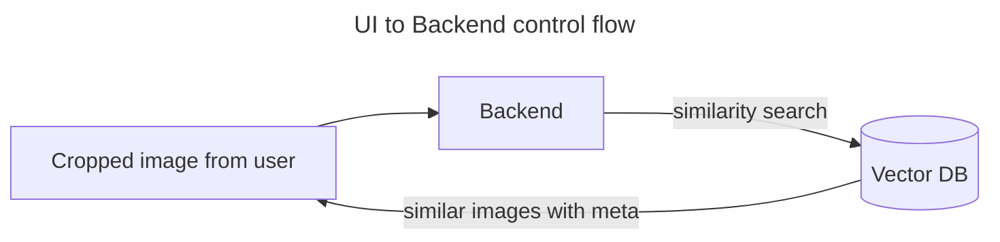
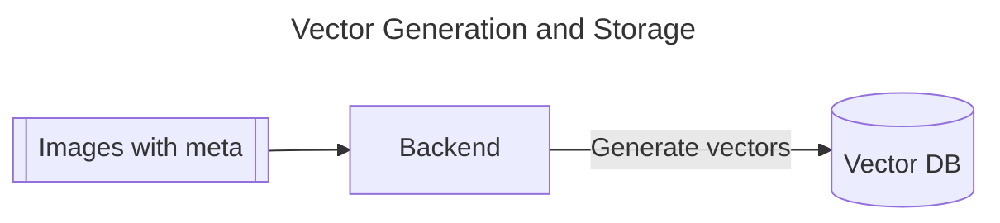

Circle to Search is a vector database powered feature that allows you to quickly search for information about what you see on your images, using a simple gesture with your finger or mouse pointer. 

### 👉 Live [Demo](https://frontend-shivamarora1s-projects.vercel.app/):

## Technologies used:


## Running in local:
1. Clone the repo.
2. Run Frontend
```
cd frontend
npm install
ng serve
```
3. Create `.env` referring to `.env.example`.
4. Run Backend
```
cd backend
npm install 
vercel dev
```



<hr>
<br>



