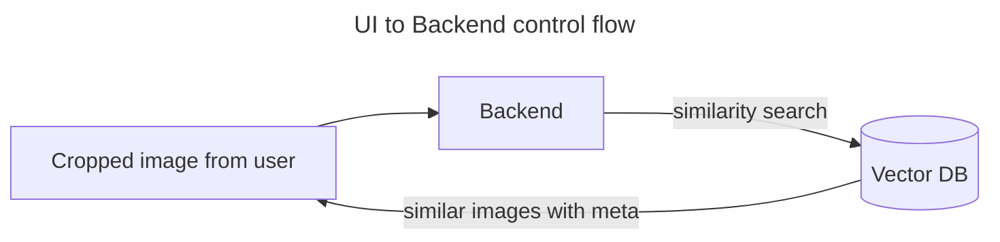
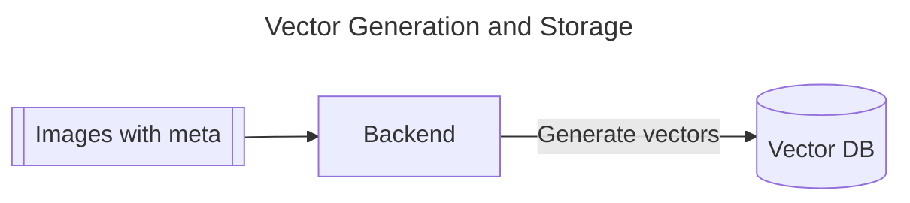

# circle-and-search
circle the object and search


Frontend deployment: 
https://frontend-shivamarora1s-projects.vercel.app/

Backend deployment:
https://backend-shivamarora1s-projects.vercel.app/

Deploy to Vercel:
```
cd frontend / backend
vercel             
```



<hr>
<br>


